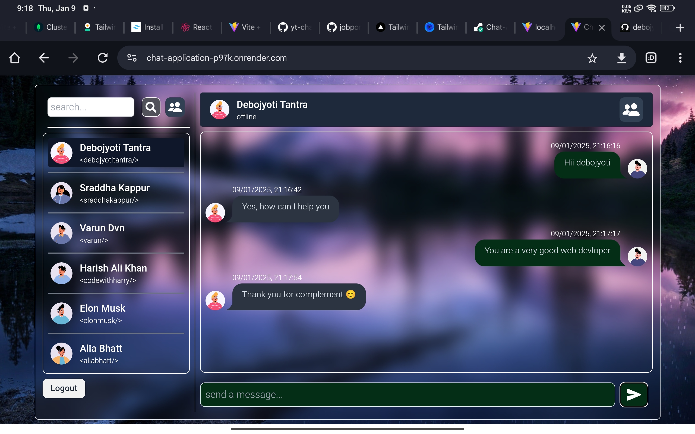
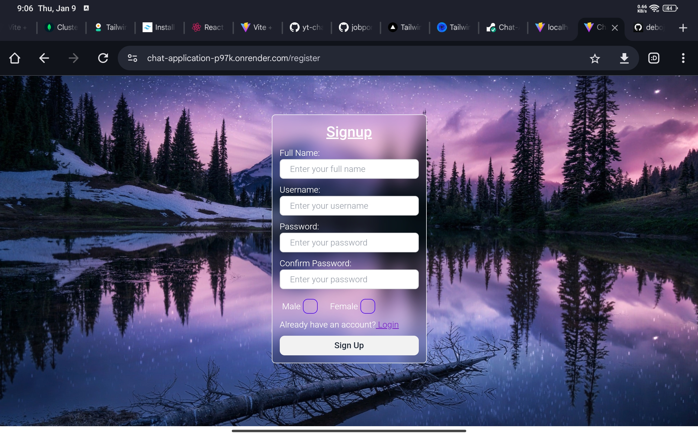
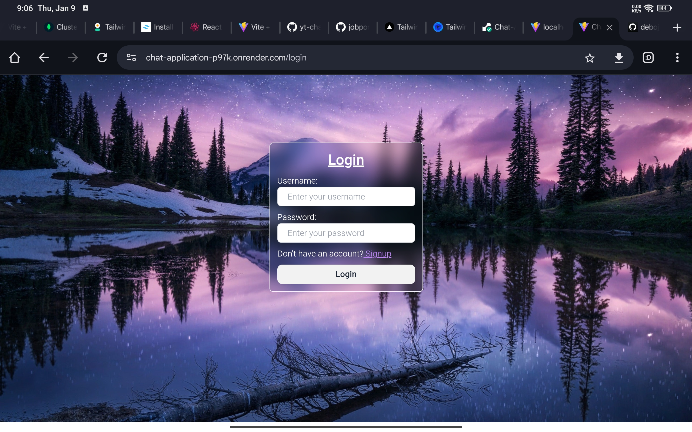

# Chat Application

This is a real-time chat application built using the **MERN stack** (MongoDB, Express.js, React.js, and Node.js) with **Socket.IO** for seamless communication between users. The app allows multiple users to chat in real time.

## Features  
- Real-time communication using **Socket.IO**  
- User authentication and session management  
- Responsive UI built with **React.js**  
- Backend powered by **Express.js** and **MongoDB**  
- Scalable and maintainable architecture  

## Technologies Used  
- **Frontend**: React.js (with hooks and context)  
- **Backend**: Node.js, Express.js  
- **Database**: MongoDB (using **MongoDB Atlas** for cloud storage)  
- **Real-time Communication**: Socket.IO  
- **Styling**: Tailwind CSS  
- **Hosting**: Render  

## Prerequisites  
- Node.js and npm installed  
- MongoDB Atlas account and database set up  
- Environment variables configured:  
  - `MONGO_URI`: MongoDB connection string  
  - `PORT`: Port number for the server  
  - (Add other environment variables if necessary)  

## Installation  

1. Clone the repository:  
   ```bash  
   git clone https://github.com/debojyoti-tantra/Chat-Application.git  
   cd Chat-Application

# Preview:
## HomePage:


## Register Page:


## Login Page:

